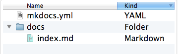

# Quick start to MKDOCS

## Setting up MKDOCS

This guide explains how to get started with Setting up MKDOCS in your windows PC.

### Check if Python, PIP installed

Check if python and pip are already installed in your PC.
You can enter following commands in windows command prompt (CMD) to make the check.

````
python --version
````
Result: `Python 2.7.2`

````
pip --version
````
Result: `pip 1.5.2`

If python and pip are not installed in the system, your first duty is to install python 
and then pip. Later add the paths of Python installation directory (default is `C:\Python27`)
and Python installation's script (default is `C:\Python27\Scripts`)
directory to Windows **PATH** Environmental Variable. So that you can run Python and pip 
from any location in windows CMD without referring to the full installation path name always.

You can get clear instructions [here][1].

You can later upgrade pip to its latest version by running below command in CMD:
````
pip install --upgrade pip
````
### Install MKDOCS

Once python and pip are installed in your pc, you can go ahead with MKDOCS package installation
using below command:
````
pip install mkdocs
````
You can check the installation of MKDOCS by running below command:
````
mkdocs --version
````
Result: `mkdocs, version 0.15.3`

I have used Materials theme for my MKDOCS website. It can be installed using pip by running below command:
````
pip install mkdocs-material
````
### Getting Started

In windows CMD go to the folder where you want to create a new project. Once you are there, you can simply 
create the project (project name = **my-project**) by running below command:
````
mkdocs new my-project
````
This creates your project with following file structure:


MkDocs comes with a built-in dev-server to preview your documentation on the go as you work. 
For this, make sure you're in the same folder as the mkdocs.yml file inside your project, 
and then start the server by running the following command:
````
mkdocs serve
````
As a result you would get following message once you run the command in CMD.
````
INFO    -  Building documentation...
INFO    -  Cleaning site directory
[I 160402 15:50:43 server:271] Serving on http://127.0.0.1:8000
[I 160402 15:50:43 handlers:58] Start watching changes
[I 160402 15:50:43 handlers:60] Start detecting changes
````
Open up `http://127.0.0.1:8000/` in your browser, and you'll see the default home page being displayed.
For more details on how to configure your static website, you can look into their official website [here][2].
Also you can customize your static website with Material theme, you can find the details [here][3].

## Backup Source code in GitHub


## Host website in GitHub


[1]:https://github.com/BurntSushi/nfldb/wiki/Python-&-pip-Windows-installation
[2]:http://www.mkdocs.org/
[3]:https://squidfunk.github.io/mkdocs-material/
